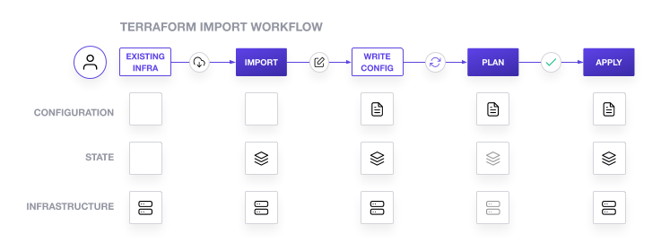
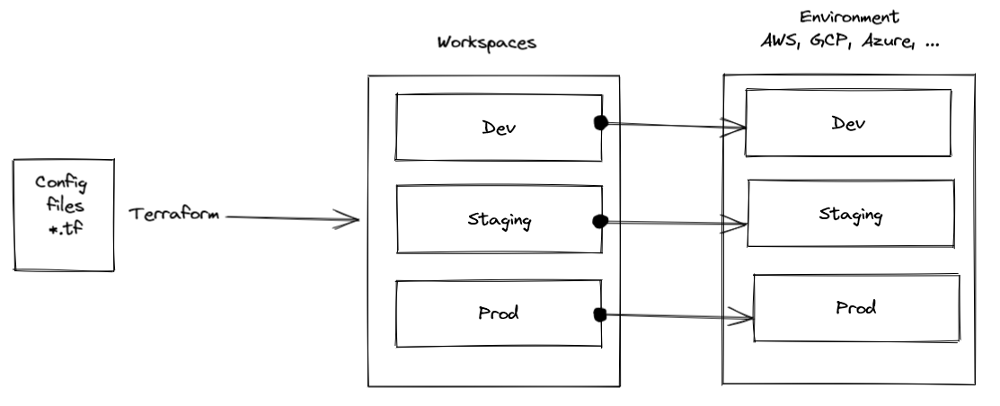

# Use the Terraform CLI (outside of core workflow)

### Command: fmt

The terraform fmt command is used to <ins>rewrite Terraform configuration files</ins> to a **canonical format and style**. This command applies a subset of the Terraform language style conventions, along with other minor adjustments for readability.

**Usages and Options**

- It possesses enhancing code readability. (`terraform fmt`)
- Cheking files for formating inconsistencies. (`-check` option)
-  It can preview the inconsistencies and changes. (`-diff` option) 

**Secnario**

Consider `main.tf` file that we have malformed deliberately.

```tf
resource "aws_security_group" "sg_8080" {
  name = "terraform-learn-state-sg-8080"
  ingress {
    from_port   = "8080"
    to_port     = "8080"
    protocol    = "tcp"
    cidr_blocks = ["0.0.0.0/0"]
    ## It's deliberately for to demonstrate how to apply the correct formatting ##
}
}
```

Now we can check which file needs formatting correction by the following command
```bash
$ terraform fmt -check
main.tf
```

We can also use `-diff` option to preview the changes and use `-recursive` to check all sub-directories.

```bash
$ terraform fmt -check -diff -recursive
main.tf
--- old/main.tf
+++ new/main.tf
@@ -55,7 +55,7 @@
     protocol    = "tcp"
     cidr_blocks = ["0.0.0.0/0"]
     ## It's deliberately for to demonstrate how to apply the correct formatting ##
-}
+  }
 }
```

Following command is for applying the proper Terraform format
```bash
$ terraform fmt
# OR 
$ terraform fmt <FILE_NAME>
```

You've now formatted `main.tf` file.

```tf
resource "aws_security_group" "sg_8080" {
  name = "terraform-learn-state-sg-8080"
  ingress {
    from_port   = "8080"
    to_port     = "8080"
    protocol    = "tcp"
    cidr_blocks = ["0.0.0.0/0"]
    ## It's deliberately for to demonstrate how to apply the correct formatting ##
  }
}
```

### Command: taint (or `-replace` option)

> Warning: This command is <ins>**deprecated**</ins>. For Terraform v0.15.2 and later, <br> we recommend using the `-replace` option with `terraform apply` instead.

It's very useful in cases where a user **manually** changes a setting on a resource or when <ins>you need to update a provisioning script</ins>. This allows you to rebuild **specific** resources and *avoid* a full terraform destroy operation on your configuration. The `-replace` flag allows you to target specific resources and avoid destroying all the resources in your workspace just to fix one of them.

> The terraform taint command manually marks a Terraform-managed <br> resource as tainted, forcing it to be destroyed and recreated on the <ins>**next apply**</ins>.


**Usages and Options**

- Replacing specific resource with CLI.(re-create)
- Rebuilding particular resource as you need to update a provisioning script.
- Using as a force-reload resource even though there are no configuration changes that would require it.

```sh
terraform taint "<resource>" && terraform plan && terraform apply
# OR
terraform plan|apply -replace="<resource>"
```

**Secnario (`-replace`)**

After applying the `main.tf` file we can check the state list and output informations by following commands.
```bash
$ terraform state list
data.aws_ami.ubuntu
aws_instance.example
aws_security_group.sg_8080
```
```bash
$ terraform output
instance_id = "i-0dc637fd3ac572929"
public_ip = "34.205.20.4"
security_group = "sg-083239250de08e8d2"
```

Now we can use `-replace` option with `terraform plan` that shows we will have two changes for public ip and instance_id since they will be recreated.

```bash
$ terraform plan -replace="aws_instance.example"
## ....
Plan: 1 to add, 0 to change, 1 to destroy.

Changes to Outputs:
  ~ instance_id = "i-0dc637fd3ac572929" -> (known after apply)
  ~ public_ip   = "34.205.20.4" -> (known after apply)
## ...
```
```bash
$ terraform apply -replace="aws_instance.example"
## ...
aws_instance.example: Destroying... [id=i-0dc637fd3ac572929]
## ...
aws_instance.example: Creation complete after 1m7s [id=i-0b318400b8d0d3f57]
```

### Command: import

Import will find the **existing resource** from ID and import it into your Terraform state at the **given** ADDRESS.

**Usages and Options**

- Importing exicting resources in Terraform repository.

*NOTE:* Bringing existing infrastructure under Terraform's control involves five main steps ([link](https://learn.hashicorp.com/tutorials/terraform/state-import)):

<p align="center">
  
</p>

1. Identify the existing infrastructure to be imported.
2. Import infrastructure into your Terraform state.
3. Write Terraform configuration that matches that infrastructure.
4. Review the Terraform plan to ensure the configuration matches the expected state and infrastructure.
5. Apply the configuration to update your Terraform state.

**Secnario**

It is assumed that we have manually launched aws ec2 instance with instance_id: `i-0b29c9420c8b83ce6` 

With bellow command we can import the existing resource to Terraform state.
```bash
$ terraform import aws_instance.manually-launched i-0b29c9420c8b83ce6
aws_instance.manually-launched: Importing from ID "i-0b29c9420c8b83ce6"...
aws_instance.manually-launched: Import prepared!
  Prepared aws_instance for import
aws_instance.manually-launched: Refreshing state... [id=i-0b29c9420c8b83ce6]

Import successful!

The resources that were imported are shown above. These resources are now in
your Terraform state and will henceforth be managed by Terraform.
```

Now we should prepare configuration file:

1. Current state
```bash
$ terraform show -no-color > aws-ec2.tf
```
Afterwards, when we run `terraform plan` we will face some warnings and errors which are related to deprecated or read-only argument. So remove all of these attributes and again run `terraform plan`

```bash
$ terraform plan
aws_instance.manually-launched: Refreshing state... [id=i-0b29c9420c8b83ce6]

No changes. Your infrastructure matches the configuration.
```
2. Cherry-pick configuration

Run terraform show to find the correct values for the missing attributes and copy and past it in configuration file.


### Workspaces

Workspaces in Terraform are simply independently managed state files. We can manage *multiple environments* with *Workspaces*.

<p align="center">
  
</p>

For example, creating a new workspace:
```bash
$ terraform workspace new dev
Created and switched to workspace "dev"!

You're now on a new, empty workspace. Workspaces isolate their state,
so if you run "terraform plan" Terraform will not see any existing state
for this configuration.
```

With bellow command we can see all available workspaces and with `select` option we can choose it.

```bash
$ terraform workspace list
  default
* dev
```

### State Command

> **NOTE:** Terraform stores state about your infrastructure and configuration.<br> It's used by Terraform for keeping track of metadata and improving performance for large scale infrastructure.<br> 
> - `local state` This state is stored by default in **local** file named "<ins>terraform.tfstate</ins>".
> - `remote state` This state can be stored **remotely**, which works better in a team environment and for larg scale project.

**Purpose of Terraform State** ([link](https://www.terraform.io/language/state/purpose))
- Mapping to the Real World
- Metadata
- Performance
- Syncing


There are some cases where you may need to **modify** the Terraform state.<br>
All terraform state subcommands that modify the state <ins>write backup files</ins>. The path of these backup file can be controlled with `-backup` and backups for state modification *can not be disabled*.

**Manipulating State**
<details>
<summary> Preview </summary>

- Inspecting State
  - `state list`
  - `state show`
  - `refresh`
- Force Re-creating (Tainting)
  - `taint`
  - `untaint`
- Moving Resources
  - `state mv`
  - `state rm`
  - `state replace-provider`
- Disaster Recovery
  - `state pull`
  - `state push`
  - `force-unlock`

</details>
<br />

`terraform state mv` command is used for renaming a resource, or moving a resource into or out of a child module. The move command will update the resource in state, but **not** in your *configuration file*. Also it moves resources from one state file to another.<br />

`terraform state rm` command tells Terraform to stop managing and tracking a resource as part of current configuration without destroying it. For starting managing and tracking the resource again we can use `terraform import`.

**Secnario**

The new_state subdirectory contains a new Terraform configuration. This configuration creates a new EC2 instance named `aws_instance.example_new` and uses a data resource to use the same security group from your root configuration file. Change into the subdirectory.<br />
After `cd` in new_state directory and running `terraform init` and `terraform apply` we will have a second state file. Now we want to move new ec2 instance to the old configuration's file which will be specified by the `-state-out` flag.<br />

Set the destination name to the same name, since in this case <ins>there is no resource with the same name</ins> in the target state file.

```bash
$ terraform state mv -state-out=../terraform.tfstate aws_instance.example_new aws_instance.example_new
Move "aws_instance.example_new" to "aws_instance.example_new"
Successfully moved 1 object(s).
```
Check `terraform state list` in current directory and previous.

```bash
$ terraform state list
data.aws_ami.ubuntu
data.terraform_remote_state.root
## ...
$ terraform state list
data.aws_ami.ubuntu
aws_instance.example
aws_instance.example_new
aws_security_group.sg_8080
```
Without adding the ec2 resource in configuration file you moved, if you run `terraform apply`  it will be removed ec2 new instance since it's not in configuration file.
<br />

`terraform state rm` removes specific resources from your state file. (NOT from your configuration file) <br />

Remove your `security_group` resource from state.
```bash
$ terraform state rm aws_security_group.sg_8080
```
Run `terraform import` for adding security group to state file again.
```bash
$ terraform import aws_security_group.sg_8080 $(terraform output -raw security_group)
```
Use `terraform refresh` command for updating the state file.


### Debugging Terraform

You can generate logs from the Terraform provider and the core application separately.<br> loge levels include `TRACE`, `DEBUG`, `INFO`, `WARN` or `ERROR` to change the verbosity of the logs. For **bug** reports, you should set the `TF_LOG_CORE` to the `TRACE` level.
```bash
$ export TF_LOG_CORE=TRACE
```
`TRACE` provides the highest level of logging and contains all the information the development teams need.<br>

You can also generate **provider** logs by setting the `TF_LOG_PROVIDER` environment variable.
```bash
$ export TF_LOG_PROVIDER=TRACE
```
Once you have configured your logging, set the path for your error logs as an environment variable. If your `TF_LOG_CORE` or `TF_LOG_PROVIDER` environment variables are enabled, the `TF_LOG_PATH` variable will create the specified file and append logs generated by Terraform.
```bash
$ export TF_LOG_PATH=logs.txt
```
To generate an example of the core and provider logs, run a `terraform refresh` operation.
```bash
$ terraform refresh
```